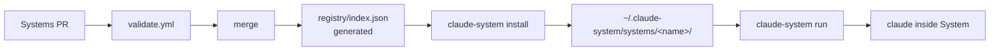

<!-- markdownlint-disable MD013 MD033 MD041 MD060 -->
<p align="center">
  
</p>
<p align="center"><em>Demo: <code>claude-system list</code> → <code>install</code> → <code>run</code> — one System, one shot. No demo asset yet — this will be <code>docs/assets/demo.gif</code> (800×450, ~10s).</em></p>

<h1 align="center">claude-system</h1>

<p align="center"><strong>Curated, opinionated Systems for Claude Code.</strong> <code>curl | sh</code> and you have a complete workflow — not plugins one by one.</p>

<p align="center">
  <a href="https://www.npmjs.com/package/claude-system"></a>
  <a href="https://pypi.org/project/claude-system/"></a>
  <a href="https://github.com/hariomlohardev/claude-system/actions/workflows/validate.yml"></a>
  <a href="./LICENSE"></a>
  
  
  <a href="https://github.com/hariomlohardev/claude-system/issues?q=is%3Aissue+is%3Aopen+label%3A%22good%20first%20issue%22"></a>
</p>

<p align="center">
  <em>One registry, one store, always fresh — Claude Code's native plugins install tools; <code>claude-system</code> installs tested workflows.</em><br>
  <code>list</code> • <code>search</code> • <code>info</code> • <code>install</code> • <code>run</code> • <code>update</code> • <code>create</code> • <code>validate</code> • <code>report</code>
</p>

---

## Install

```sh
curl -fsSL https://raw.githubusercontent.com/hariomlohardev/claude-system/main/install.sh | sh
```

Alternatives:

```sh
npm i -g claude-system
pip install claude-system
git clone https://github.com/hariomlohardev/claude-system.git && npm --prefix claude-system/cli install
```

Requires **Node >= 18** and the [`claude` CLI](https://docs.anthropic.com/en/docs/claude-code) on your `PATH`.

## Quickstart — 30 seconds

```sh
claude-system list
claude-system search open-source
claude-system info open-source
claude-system install open-source
claude-system run open-source
```

`install` drops the System to `~/.claude-system/systems/<name>/` and
records `{ version, installedAt, setupDone }` in
`~/.claude-system/systems.json`. `run` opens `claude` inside that
System — first run shows `setup.sh`'s `WHY` message and asks
`Are you sure you want to continue? (y/N)` — once `setup.sh` exits `0`,
`setupDone` is set and never prompted again.

## How it works



- **One canonical registry** — `registry/index.json` is generated from
  `systems/*/system.json` by `scripts/generate-index.js`, never hand-edited.
- **One global store** — `~/.claude-system/systems/<name>/` plus
  `~/.claude-system/systems.json` for `setupDone`.
- **Always fresh** — every `list`/`search`/`info`/`install`/`update` fetches
  from `https://raw.githubusercontent.com/hariomlohardev/claude-system/main/registry/index.json`
  with `Cache-Control: no-cache`.

## Features

| Feature | `list` | `search` | `info` | `install` | `run` |
|---|:---:|:---:|:---:|:---:|:---:|
| Always fresh (`Cache-Control: no-cache`) | ✓ | ✓ | ✓ | ✓ | — |
| Category filter (`--category`) | ✓ | — | — | — | — |
| Keyword search (`name`/`displayName`/`description`/`keywords`) | — | ✓ | — | — | — |
| Shows `permissions`/`setup.sh` note | — | — | ✓ | — | — |
| Copies to `~/.claude-system/systems/<name>/` | — | — | — | ✓ | — |
| One-time `setup.sh` consent (`WHY` → `y/N`, `setupDone`) | — | — | — | — | ✓ |
| Forwards `-- <args>` to `claude` | — | — | — | — | ✓ |
| Validates `system.json` + `name===folder` + security | ✓ | ✓ | ✓ | ✓ | ✓ |

## Available Systems

| System | Description |
| --- | --- |
| `example-system` | Reference fixture for CI and docs — not for real use. Validates the schema and generator. |

More Systems are added via PRs to `systems/` — see
[Contributing](./CONTRIBUTING.md). `claude-system list` is the source of
truth; this table is a V1 snapshot.

## Creating a System

```sh
cp -r template/starter-system systems/my-system
# edit systems/my-system/system.json (name === folder, kebab-case)
# edit systems/my-system/CLAUDE.md and README.md
node cli/dist/index.js validate systems/my-system
# open PR into systems/my-system/ — validate.yml must be green
```

Checklist: `system.json` validates, `name` equals folder, required files
`system.json`/`CLAUDE.md`/`README.md` present, `permissions[]` honestly
declared, `setup.sh` has `# WHY:` if present, and you did **not**
hand-edit `registry/index.json`.

→ Full guide: [`docs/creating-a-system.md`](./docs/creating-a-system.md)

## Commands

| Command | What it does |
| --- | --- |
| `list [--installed\|--available] [--category <cat>]` | List Systems from the registry or only installed ones |
| `search <query>` | Keyword search over `name`, `displayName`, `description`, `keywords` |
| `info <system>` | Show manifest, permissions, links, and install status |
| `install <system>` | Copy to `~/.claude-system/systems/<name>/` and record in `systems.json` |
| `remove <system>` | Remove the System and its entry in `systems.json` |
| `update [<system>\|--all]` | Update to the latest registry version (preserves `setupDone`) |
| `report <system>` | Open the tracker's issue page (`bugs.url` → `repository/issues` → monorepo) |
| `run <system> [-- <args>]` | Open `claude` inside the System (one-time `setup.sh` consent) |
| `create <name>` | Scaffold `systems/<name>/` from `template/starter-system` |
| `validate [path]` | Validate `system.json` + required files + `name===folder` + security |
| `--help`, `--version` | Themed help and version via `commander` |

## Why claude-system?

| Tool | Lacks |
|---|---|
| `claude` plugins one by one | No curated, versioned workflow; no `setup.sh` consent; no registry |
| Copy-pasting `CLAUDE.md` | No versioning, no `validate.yml`, no `permissions` review |
| Ad-hoc dotfiles | No `list`/`search`/`info`, no `~/.claude-system` store |

**Moat:** Every System is a screenshot. Every `run` is a demo.
`curl | sh` is zero friction, `validate.yml` is the quality gate.

## Development

```sh
git clone https://github.com/hariomlohardev/claude-system && cd claude-system
npm --prefix cli ci
npm --prefix cli run build
npm --prefix cli test
node scripts/generate-index.js
node cli/dist/index.js validate
```

See [`CONTRIBUTING.md`](./CONTRIBUTING.md). `npm run build` + `npm test`
before PR. `registry/index.json` is generated — restore before committing
(`git restore registry/index.json`) unless you are cutting a release.

## Docs

- [`SYSTEM_SPEC.md`](./SYSTEM_SPEC.md) — formal contract
- [`docs/creating-a-system.md`](./docs/creating-a-system.md) — contributor guide
- [`docs/security.md`](./docs/security.md) — trust model and permissions
- [`CONTRIBUTING.md`](./CONTRIBUTING.md) — how to contribute
- [`CODE_OF_CONDUCT.md`](./CODE_OF_CONDUCT.md) — Covenant 2.1
- [`SECURITY.md`](./SECURITY.md) — advisories
- [`LICENSE`](./LICENSE) — MIT

## Author

Built by [Hariom Lohar](https://hariomlohardev.github.io/) — `hariomlohar.new@gmail.com`

## License

MIT — see [LICENSE](./LICENSE).

Built for Claude Code — this project does not replace it, it just launches
it in the right place.
