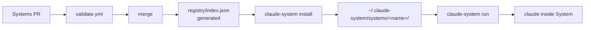

<!-- markdownlint-disable MD013 MD060 -->
# claude-system

Curated, opinionated Systems for Claude Code — install a complete workflow
in one shot, not plugins one by one.

[](https://www.npmjs.com/package/claude-system)
[](https://pypi.org/project/claude-system/)
[](https://github.com/hariomlohardev/claude-system/actions/workflows/validate.yml)
[](./LICENSE)

Claude Code's plugin system installs tools. `claude-system` installs
**complete, tested workflows** — a `CLAUDE.md` prompt, skills, agents,
commands, and hooks — as a single versioned System. One command to
discover, one to install, one to run. The System is then the project
context that `claude` sees.

## Install

```sh
curl -fsSL https://raw.githubusercontent.com/hariomlohardev/claude-system/main/install.sh | sh
```

Alternatives:

```sh
npm i -g claude-system
pip install claude-system
git clone https://github.com/hariomlohardev/claude-system.git && npm --prefix claude-system/cli install
```

**Requirements:** **Node >= 18** and the [`claude` CLI](https://docs.anthropic.com/en/docs/claude-code)
on your `PATH`. Verify with `node -v` and `claude --version`. No other
runtime is required — the registry is plain JSON.

## Quickstart

The 30-second loop — discover, inspect, install, run:

```sh
claude-system list
claude-system search open-source
claude-system info open-source
claude-system install open-source
claude-system run open-source
```

`install` copies `systems/<name>/` to `~/.claude-system/systems/<name>/`
and records `{ version, installedAt, setupDone }` in
`~/.claude-system/systems.json`. `run` opens `claude` inside that
System. The first `run` for a System that ships `setup.sh` shows its
`WHY` message and asks `Are you sure you want to continue? (y/N)` — once
you confirm and `setup.sh` exits `0`, `setupDone` is set and never
prompted again. See [`docs/creating-a-system.md`](./docs/creating-a-system.md)
for the full authoring flow.

## How it works



- **One canonical registry** — `registry/index.json` is generated from
  `systems/*/system.json` by `scripts/generate-index.js`, never hand-edited.
  It is the small file the CLI fetches for `list`/`search`/`info`.

- **One global store** — every installed System lives as a full copy in
  `~/.claude-system/systems/<name>/`. Bookkeeping is in
  `~/.claude-system/systems.json` (`setupDone` tracks the one-time consent).

- **Always fresh** — every `list`, `search`, `info`, `install`, and `update`
  fetches from
  `https://raw.githubusercontent.com/hariomlohardev/claude-system/main/registry/index.json`
  with `Cache-Control: no-cache`. No TTL, no stale cache.

## Available Systems

| System | Description |
| --- | --- |
| `example-system` | Reference fixture for CI and docs — not for real use. Validates the schema and generator. |

More Systems are added via PRs to `systems/` — see
[Contributing](./CONTRIBUTING.md). `claude-system list` is the source of
truth; the table above is just a snapshot for V1.

## Creating a System

For contributors — scaffold, edit, validate, PR:

```sh
cp -r template/starter-system systems/my-system
# edit systems/my-system/system.json (name === folder, kebab-case)
# edit systems/my-system/CLAUDE.md and README.md
node cli/dist/index.js validate systems/my-system
# open PR into systems/my-system/ — validate.yml must be green
```

Checklist: `system.json` validates, `name` equals folder, required files
`system.json`/`CLAUDE.md`/`README.md` present, `permissions[]` honestly
declared (`shell:exec` if `setup.sh` exists), `setup.sh` contains a
`# WHY:` line if present, and you did **not** hand-edit
`registry/index.json`.

→ Full guide: [`docs/creating-a-system.md`](./docs/creating-a-system.md)

## Commands

| Command | What it does |
| --- | --- |
| `list [--installed\|--available] [--category <cat>]` | List Systems from the registry or only installed ones |
| `search <query>` | Keyword search over `name`, `displayName`, `description`, `keywords` |
| `info <system>` | Show manifest, permissions, links, and install status |
| `install <system>` | Copy to `~/.claude-system/systems/<name>/` and record in `systems.json` |
| `remove <system>` | Remove the System and its entry in `systems.json` |
| `update [<system>\|--all]` | Update to the latest registry version (preserves `setupDone`) |
| `run <system> [-- <args>]` | Open `claude` inside the System (one-time `setup.sh` consent) |
| `create <name>` | Scaffold `systems/<name>/` from `template/starter-system` |
| `validate [path]` | Validate `system.json` + required files + `name===folder` + security |
| `report <system>` | Open the tracker's issue page (`bugs.url` → `repository/issues` → monorepo) |
| `--help`, `--version` | Themed help and version via `commander` |

Run `claude-system --help` or `claude-system <command> --help` for
per-command flags. Help output uses the same muted palette as `claude`.

## Docs

- [`SYSTEM_SPEC.md`](./SYSTEM_SPEC.md) — formal contract
- [`docs/creating-a-system.md`](./docs/creating-a-system.md) — contributor guide
- [`docs/security.md`](./docs/security.md) — trust model and permissions
- [`CONTRIBUTING.md`](./CONTRIBUTING.md) — how to contribute a System
- [`CODE_OF_CONDUCT.md`](./CODE_OF_CONDUCT.md) — Contributor Covenant 2.1
- [`SECURITY.md`](./SECURITY.md) — supported versions and advisories
- [`LICENSE`](./LICENSE) — MIT

## Development

```sh
npm --prefix cli ci
npm --prefix cli run build
npm --prefix cli test
node scripts/generate-index.js
node cli/dist/index.js validate
```

`registry/index.json` is generated — run the generator and restore before
committing (`git restore registry/index.json`) unless you are cutting a
release.

## License

MIT — see [LICENSE](./LICENSE).

Built for Claude Code — this project does not replace it, it just launches
it in the right place.
