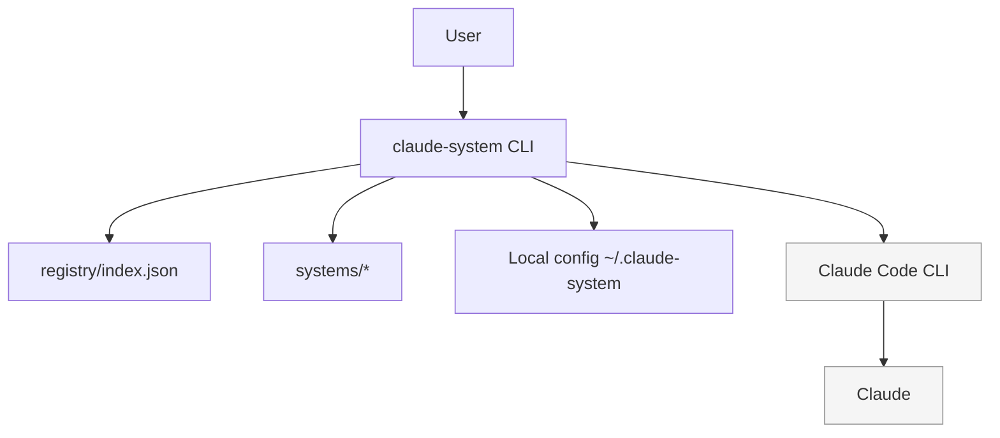
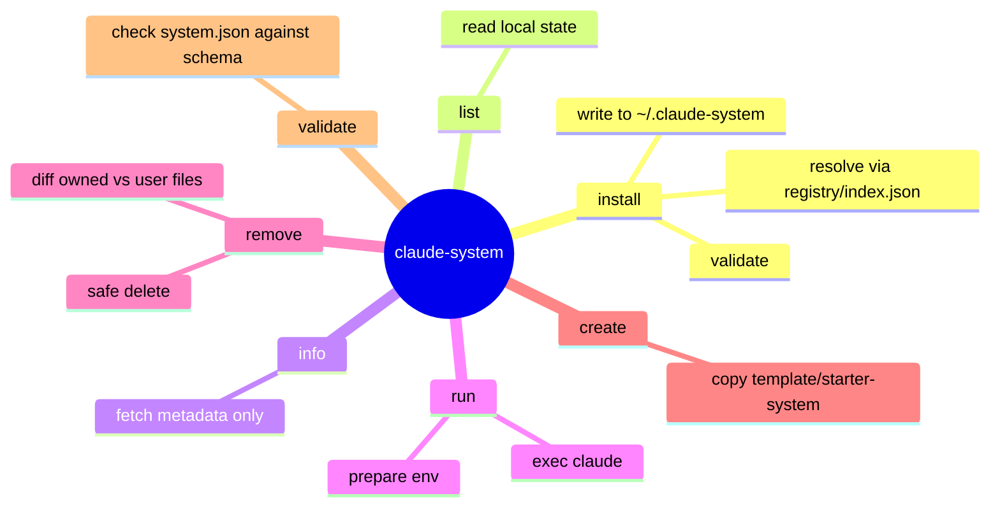
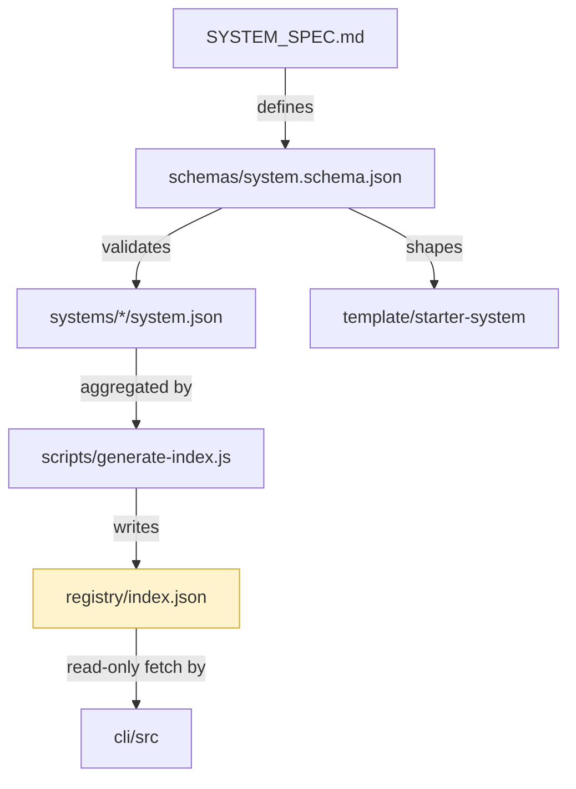
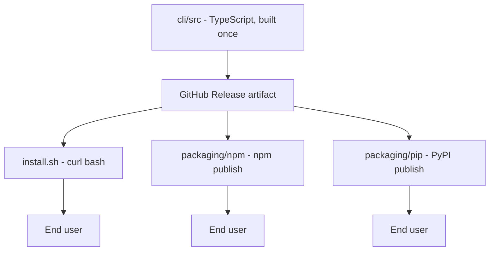

# claude-system — Mindmap

Quick visual orientation. For prose detail, see `SYSTEM_SPEC.md` and
`docs/architecture.md`.

## 1. Layer stack

`claude-system` never talks to the model directly. It prepares an
environment, then invokes `claude` (Claude Code), which does the actual AI
work.

## 2. Repo internals: how a System gets from PR to installed

```mermaid
flowchart LR
    A[Contributor forks repo] --> B[Copies template/starter-system]
    B --> C[Edits system.json + CLAUDE.md + skills/agents/commands]
    C --> D[Opens PR into systems/name]
    D --> E{validate.yml}
    E -- fail --> B
    E -- pass --> F[Maintainer review]
    F --> G[Merge]
    G --> H[scripts/generate-index.js regenerates registry/index.json]
    H --> I[User: claude-system install name]
    I --> J[CLI fetches registry/index.json, resolves path, clones/copies systems/name]
    J --> K[Local install under ~/.claude-system/systems/name]
    K --> L[claude-system run name -> invokes Claude Code with that config]
```

## 3. Command surface (MVP)

## 4. Data ownership — what must never drift apart

`registry/index.json` (highlighted) is the one file in the repo that is
**generated, not authored**. If you find yourself hand-editing it, stop —
edit the source `system.json` and regenerate instead.

## 5. Distribution channels — one core, three doors

No logic is duplicated across the three install paths — each is a thin
fetch-and-place wrapper around the same built artifact.